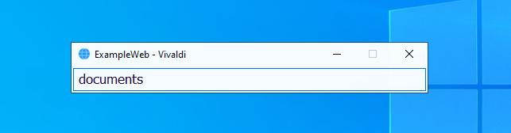

# Windows Web Search Bars :mag:

> Made with **[AutoHotkey 2.0](https://www.autohotkey.com/boards/viewtopic.php?f=24&t=112989)**

[](./screenshots/ecosia.png)

[](./screenshots/youtube.png)

## Table of contents
1. [Requirements :page_facing_up:](#requirements)
2. [Usage](#usage)
3. [Examples](#examples)
4. [Configuration :wrench:](#configuration)
    1. [Default browser and translation target language](#basic-config)
    2. [Add a new direct link](#direct-link)
    1. [Add a new search website](#search-website)
5. [Attributions](#atributions)

<a name="requirements"></a>
## Requirements :page_facing_up:
* Windows 7+

* [AutoHotkey v2](https://www.autohotkey.com/)

---

<a name="usage"></a>
## Usage

#### [Hotkeys](https://www.autohotkey.com/docs/v2/Hotkeys.htm)
```
Right Control + O => Open URL
```
```
Right Control + [Key] => Open a search bar
```
```
Right Alt / Alt Gr => Toggle private search
```
```
Right Alt / Alt Gr + [Key] => Change to another browser
```
```
Left Alt => Toggle multiline search
```
```
Enter => Submit search
```
```
Control + Enter => Submit multiline search
```

---

<a name="examples"></a>
## Examples

> #### Tip :sparkles: 
> Leave the input blank to open the home page instead of performing a search

###### Open URL: Right Control + O
[](./screenshots/open.png)

###### Search images in private / incognito: Right Control + I, then, Right Alt / Alt Gr
[](./screenshots/images.png)

###### Translation of multiline text: Right Control + T, then, Left Alt, then Ctrl + Enter
[](./screenshots/translate.png)

> :pushpin: Check the 'Main.ahk' script to see all the predefined hotkeys and search websites

---

<a name="configuration"></a>
## Configuration :wrench:

<a name="basic-config"></a>
#### Edit the 'Config.ahk' script

> ##### 1. Set the default web browser
```
; 'LibreWolf' | 'Edge' | 'Brave' | 'Vivaldi' | 'Chrome' ...
DefaultBrowser := "LibreWolf"
```

> ##### 2. Set the translation target language
```
; 'en' | 'es' | 'de' ...
TranslationTargetLang := "en"
```

> ##### 3. Reload and test the script
[](./screenshots/reload.png)

----

<a name="direct-link"></a>
#### Add a new direct link

> ##### 1. Add a new [hotkey](https://www.autohotkey.com/docs/v2/Hotkeys.htm) to the 'Main.ahk' script
###### OpenURL() arguments:
1. The URL.
2. The web browser that will be used (optional, default if omitted).
3. Open in private / incognito window (optional, default 'False').

```
; Right Control + A => Opens Azure in a private Firefox window
>^A Up:: OpenURL('https://azure.microsoft.com', Firefox, True)
```

> ##### 2. Reload and test the script
> _Right Control + A_

---

<a name="search-website"></a>
#### Add a new search website

> ##### 1. Add the web .ico file
```
icons/exampleweb.ico
```

> ##### 2. Add a new _Website_ object to the 'Websites.ahk' script

###### *Website* arguments:
1. Title: Must match the icon name, without extension. Case insensitive.
2. HomeURL: It will be open when the text box is blank.
3. SearchURL: The value of 'Website.TermTemplate' will be replaced with the search term.

```
ExampleWebSearch := Website(
    "ExampleWeb",
    "https://example.com",
    "https://example.com/search_query=" Website.TermTemplate "&order=ASC"
)
```

> ##### 3. Add the corresponding [hotkey](https://www.autohotkey.com/docs/v2/Hotkeys.htm) in the 'Main.ahk' script

###### ShowSearchBar() arguments:
1. The _Website_ object.
2. The web browser that will be used (optional, default if omitted).
3. Open in private / incognito (optional, default 'False').
4. Multiline input (optional, default 'False').

```
>^X Up:: ShowSearchBar(ExampleWebSearch, Vivaldi) ; Right Control + X
```

> ##### 4. Reload and test the script
> _Right Control + X_
[](./screenshots/exampleweb.png)

---

<a name="atributions"></a>
## Attributions

#### Icons:
<a href="https://www.flaticon.es/iconos-gratis/mozilla" title="mozilla iconos">Mozilla iconos created by Freepik - Flaticon</a>

<a href="https://www.flaticon.com/free-icons/image" title="image icons">Image icons created by Good Ware - Flaticon</a>

<a href="https://www.flaticon.com/free-icons/youtube" title="youtube icons">Youtube icons created by riajulislam - Flaticon</a>

<a href="https://www.flaticon.com/free-icons/external-link" title="external link icons">External link icons created by Bharat Icons - Flaticon</a>

<a href="https://www.flaticon.com/free-icons/search" title="search icons">Search icons created by Chanut - Flaticon</a>

<a href="https://www.flaticon.com/free-icons/translator" title="translator icons">Translator icons created by Freepik - Flaticon</a>

<a href="https://www.flaticon.com/free-icons/google" title="google icons">Google icons created by Freepik - Flaticon</a>

<a href="https://www.flaticon.es/iconos-gratis/cromo" title="cromo iconos">Crome icons created by Pixel perfect - Flaticon</a>

<a href="https://www.flaticon.com/free-icons/docker" title="docker icons">Docker icons created by Freepik - Flaticon</a>
