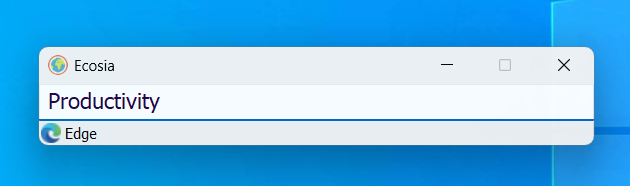
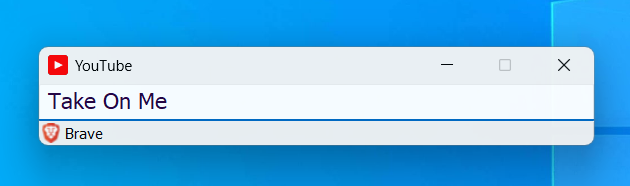
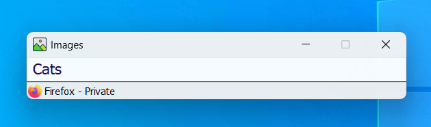
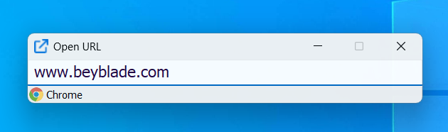
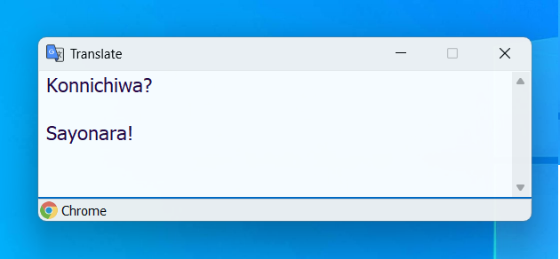
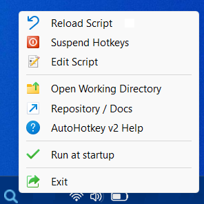

# Windows Web Search Bars :globe_with_meridians::mag:

<a name="requirements"></a>
## Requirements
##### Windows 7+

##### [AutoHotkey v2](https://www.autohotkey.com/)

[](./screenshots/ecosia.png)

[](./screenshots/youtube.png)

[](./screenshots/images.png)

[](./screenshots/open.png)

## Table of contents
1. [Usage](#usage)
2. [Examples](#examples)
3. [Configuration](#configuration)
4. [Attributions](#atributions)

---

<a name="usage"></a>
## 1. Usage

#### [Hotkeys](https://www.autohotkey.com/docs/v2/Hotkeys.htm)
```
Right Control + O => Open URL
```
```
Right Control + [Web key] => Open a search bar
```
```
Tab / Shift + Tab => Change browser
```
```
Right Alt / Alt Gr => Toggle private search
```
```
Left Alt => Toggle multiline search
```
```
Enter => Submit search
```
```
Control + Enter => Submit multiline search
```

---

<a name="examples"></a>
## 2. Examples

> #### Tip :sparkles: 
> Leave the input blank to open the home page instead of performing a search

###### Open URL: Right Control + O
[](./screenshots/open.png)

###### Search images in private / incognito: Right Control + I, then, Right Alt / Alt Gr
[](./screenshots/images.png)

###### Translation of multiline text: Right Control + T, then, Left Alt, then Ctrl + Enter
[](./screenshots/translate.png)

> :pushpin: Check the 'Main.ahk' script to see all the predefined hotkeys

---

<a name="configuration"></a>
## 3. Configuration

<a name="basic-config"></a>
#### Browsers.ahk

> ##### Set the translation target language
```
; 'en' | 'es' | 'de' | 'ja' ...
TranslationTargetLang := "en"
```

> ##### Add browsers
```
; ("Name", ".exe")
Waterfox := BrowserClass("Waterfox", "waterfox")
LibreWolf := BrowserClass("LibreWolf", "C:\Program Files\LibreWolf\librewolf.exe")
```

> ##### Set the default web browser
```
; Edge | Firefox | LibreWolf | Chrome | Vivaldi ...
DefaultBrowser := Edge
```

#### Websites.ahk

> ##### Add a new _Website_ object

###### Arguments:
1. Title: Must match the icon name, without extension. Case insensitive.
2. HomeURL: It will be open when the text box is blank.
3. SearchURL: The value of 'Website.TermTemplate' will be replaced with the search term.

```
ExampleWeb := Website(
    "ExampleWeb",
    "https://example.com",
    "https://example.com/search_query=" Website.TermTemplate "&order=ASC"
)
```

#### Main.ahk

> ##### Add the search hotkey
```
; Right Control + X => Search in ExampleWeb
>^X Up:: ShowSearchBar(ExampleWeb)
```

> ##### Add a direct link hotkey

```
; Right Control + A => Open Azure in a private Firefox window
>^A Up:: OpenURL('https://azure.microsoft.com', Firefox, True)
```

#### Reload and test the script
[](./screenshots/reload.png)

---

<a name="atributions"></a>
## 4. Attributions

#### Icons:
<a href="https://www.flaticon.es/iconos-gratis/mozilla" title="mozilla iconos">Mozilla iconos created by Freepik - Flaticon</a>

<a href="https://www.flaticon.com/free-icons/image" title="image icons">Image icons created by Good Ware - Flaticon</a>

<a href="https://www.flaticon.com/free-icons/youtube" title="youtube icons">Youtube icons created by riajulislam - Flaticon</a>

<a href="https://www.flaticon.com/free-icons/external-link" title="external link icons">External link icons created by Bharat Icons - Flaticon</a>

<a href="https://www.flaticon.com/free-icons/search" title="search icons">Search icons created by Chanut - Flaticon</a>

<a href="https://www.flaticon.com/free-icons/translator" title="translator icons">Translator icons created by Freepik - Flaticon</a>

<a href="https://www.flaticon.com/free-icons/google" title="google icons">Google icons created by Freepik - Flaticon</a>

<a href="https://www.flaticon.es/iconos-gratis/cromo" title="cromo iconos">Crome icons created by Pixel perfect - Flaticon</a>

<a href="https://www.flaticon.com/free-icons/docker" title="docker icons">Docker icons created by Freepik - Flaticon</a>
